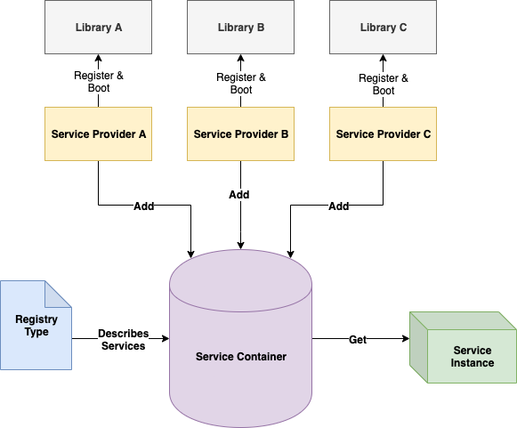

# Be Our Guest


> Fast and friendly services.

Be Our Guest is lightweight, asynchronous, inversion of control (IoC) service container developed for JavaScript and TypeScript applications.

## Why Use an IoC service container?

In modern front-end and back-end development applications are made up of many smaller modules. Often these smaller modules have dependency on other modules. Each of these modules may need a boot step to initialize it. Rather than have the module that has a dependency initialize that dependency itself, we initialize it externally and pass it into the module. By following this pattern we can initialize and manage all of our modules at a single level which greatly simplifies our architecture management. It also allows us to easily swap modules if our requirements change.

A deep dive tutorial on IoC can be found here: [https://www.tutorialsteacher.com/ioc/introduction](https://www.tutorialsteacher.com/ioc/introduction)

A service container gives our applications an easy way to register and initialize all of the modules and their dependencies.

## Why Use "Be Our Guest"?

Be Our Guest differs from other JS IoC containers primarily by its asynchronous nature. Other IoC container variations that currently exist are synchronous in nature. This presents some issues; primarily with booting dependencies that are asynchronous.

As an example let's say we have a module that handles auth within our application. After you construct and register the module it requires a boot step send some requests to the backend system to retrieve auth tokens that our other API modules will require. This action is an asynchronous action and we do not want to block initialization of our other modules while this module makes its request. We also need to inject this module into other modules that depend on the auth token. Those modules must await the initialization of our token module before they can be used. As you can see, providing async support for these types of initialization are crucial.

Be Our Guest is written in TypeScript and provides strong typing support for registering, booting, and getting your services and is centrally typed from a single provided Registry type. What this means is that you define your types once in a single place.

**Example**

```typescript
// --- Other Frameworks ---
import { MyClass } from './somewhere';

// You must pass the type every time you request a service
const myClass = services.get<MyClass>('MyClass');
```

```typescript
// --- Be Our Guest ---

// myClass will be typed to MyClass because we typed
// our services when we created our service container instance
const myClass = await services.get('MyClass');
```

### What about Automatic Dependency Injection?

Be Our Guest purposefully does not provide support for Automatic Dependency Injection (Auto-DI) for a couple of reason. First, JavaScript does not currently provide a native way to use Reflection to understand the interface of a prototype. The only way to implement Auto-DI is to use decorators to apply meta data to our modules to polyfill Reflection. Second, this adds code bloat and reduces performance as well as puts strong dependency on TypeScript. Auto-DI is a very nice feature, but ultimately it is a convenience and not required for a service container. Because of this design decision, Be Our Guest can easily be used in a vanilla JS development environment. It also makes it much easier to adopt as you will not need to add decorators to your pre-existing modules.

**NOTE:** If JavaScript releases support for Reflection in the future we might add Auto-DI as a feature.

## How It Works

Be Our Guest is made up of three parts, the **Registry Type**, the **Service Container**, and the **Service Provider**. Here is a basic diagram of how each part operates.



All services registered into the container must be wrapped by a **Service Provider**. The **Service Provider** provides hooks for registering and booting your services. All services will go through the register phase first. Once the register phase is completed then all services that define a boot method in their provider will be booted. Once your services have completed registration and booting you can then effortlessly retrieve them from the container by their key. The usage instructions below will dive deeper into setup and implementation.

## Installation

**npm**

```bash
npm install --save be-our-guest
```

**yarn**

```bash
yarn add be-our-guest
```

## Usage

Follow the appropriate link below for your environment. We highly recommend using this library with
TypeScript, but if that is not possible we are also providing vanilla JS setup instructions below.

- [TypeScript Steps](docs/typescript-steps.md)
- [JavaScript Steps](docs/javascript-steps.md)
